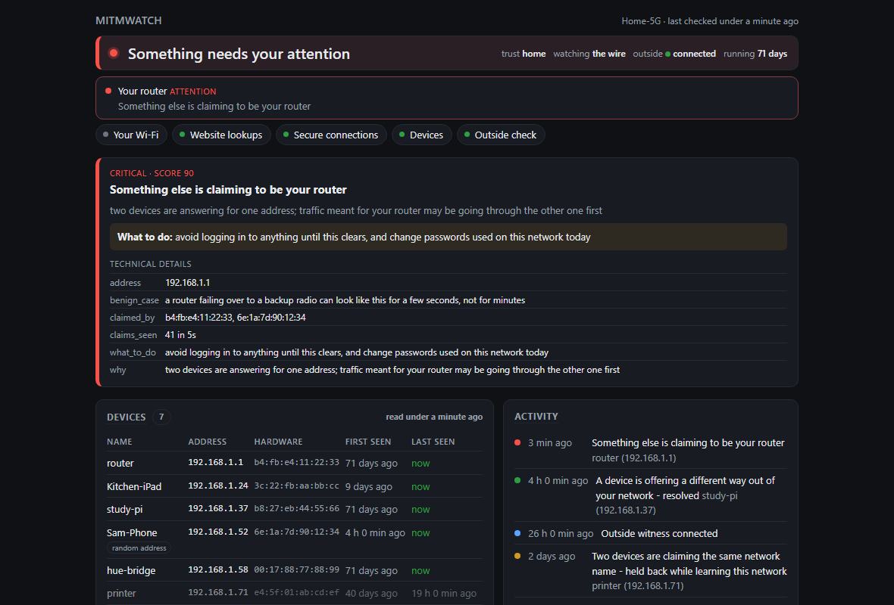
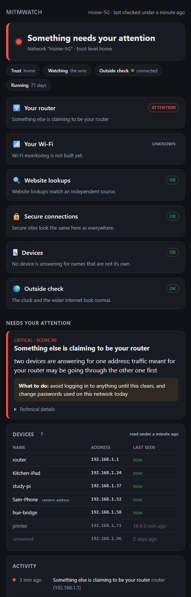
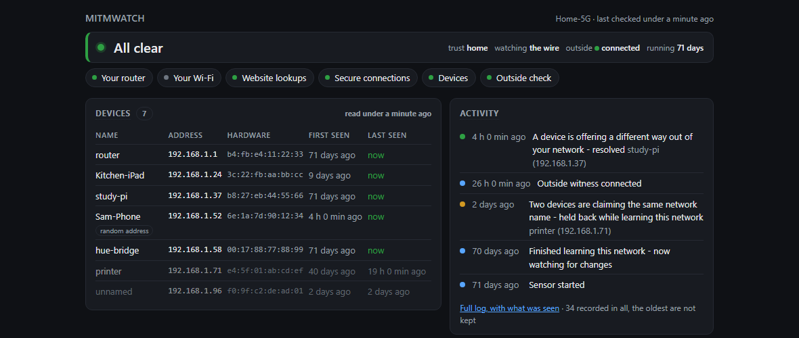
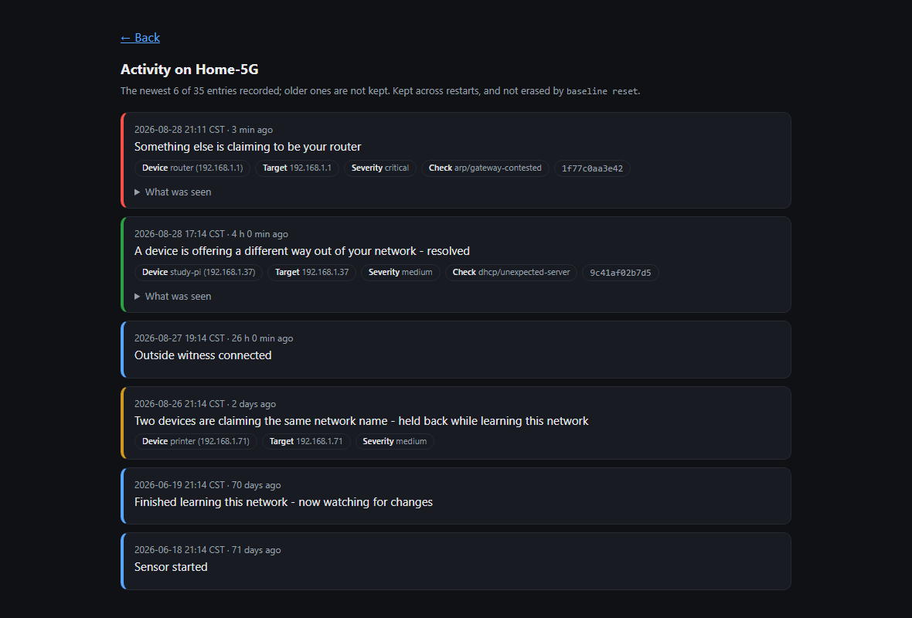

# mitmwatch

Detects interception, redirection and tampering of network traffic, and says so
in language a non-technical person can act on.

One Go binary. Standard library first, `CGO_ENABLED=0` everywhere, so the same
source cross-compiles to a Raspberry Pi with no toolchain and no libpcap.

**Status: phase 2.** Nine probes across Windows, Linux and macOS, plus a remote
**witness** that corroborates the sensor's view from another network and ASN. On
Linux with raw-capture privileges (`setcap cap_net_raw`) it watches the wire;
elsewhere it falls back to the neighbour table and says so. `mitmwatch sensor`
runs it continuously with a LAN status page; `mitmwatch check` runs it once;
`mitmwatch witness` runs the outside vantage point. The per-host agent is phase 3
and not built yet — `doctor` lists exactly what is and is not covered rather than
letting a green screen imply otherwise.

Running today on a Raspberry Pi as a resident service, with a witness on another
continent corroborating its view over a pinned mutual-TLS link, and a status
page any device on the LAN can open.

## The dashboard

`mitmwatch sensor` serves a read-only status page on the LAN. It answers "is my
network okay right now?" in one glance and, when it is not, tells a
non-technical person what to do. Nothing loads from the internet — the page, its
styles and its icon are all served from the binary — so it renders even when the
internet is exactly what is broken. The browser-tab favicon turns red the moment
something needs attention, so a background tab still tells you.

*(The screenshots below use fabricated data; the attack shown is illustrative.)*



It is responsive, and the same page reads cleanly on a phone:

<p align="center"></p>

When nothing is wrong it stays calm and green, with the device list and recent
activity to hand:



Devices are remembered by hardware address, so one that is switched off stays on
the list with the time it was last seen rather than silently disappearing, and
each row carries its own first-seen date. A device that rotates its address —
most phones do — is marked, because the history is then of the address and not
of the device.

The activity log is a record, not a scrollback. It is written to disk beside the
profile, survives restarts, is not erased by `baseline reset`, and each entry
keeps the evidence behind it. That matters most for an alert that has since
cleared: the card goes green and the alert disappears, and the entry is all
that is left. `/activity` shows the log in full, with what was seen and which
device it was:



Open it from any device on the network at `http://<sensor-ip>:8080` (set the
address with `dashboard` under `[sensor]` in the config).

## Quickstart

```
go build -o mitmwatch ./cmd/mitmwatch

./mitmwatch doctor          # what is covered on this host, and what is not
./mitmwatch check           # run every probe once; exit 1 if anything was found
./mitmwatch sensor          # run continuously, alert as things are found
```

On a Raspberry Pi, `make deploy PI_HOST=pi@host` cross-compiles, installs, and
grants the one capability raw capture needs. A systemd unit for the resident
sensor is in `docs/`.

The first run starts a ten-minute learning window for the network you are on.
During it only critical findings surface; everything else is listed as held
back, with the reason. A brand-new baseline disagrees with everything, and
alerting on that is how a detector teaches people to ignore it.

```
./mitmwatch check tls truststore        # just these probes
./mitmwatch baseline show               # what has been learned
./mitmwatch baseline accept <hash>      # "this was me"
./mitmwatch profiles list
./mitmwatch profiles trust <key> work   # a managed laptop's private CA is expected
```

## The idea

Two ideas carry most of the detection, and both are cheap.

**Listen, then compare.** The `arp` probe reads both the host's neighbour table and the wire itself. The table holds one winner per address; the wire holds the argument. Two devices claiming one address in a five-second window is that argument in progress, and it is very hard to arrange by accident.

**Verify every chain twice.** Once against a Mozilla root bundle embedded in
the binary, once against the trust store of the machine it is running on. A
detector that consults only the system store cannot see a root injected *into*
that store — which is exactly how ESET, mitmproxy, Burp and corporate proxies
work. The disagreement between the two verdicts is the finding.

**Watch the trust store directly.** Real interceptors filter selectively. On
the machine this was written on, ESET's SSL filter rewrites certificates for
.NET and browser processes and leaves an unrecognised binary alone — so the
canary probes see a clean network while the browser is being read. No capture
tier, vantage point or witness can close that gap; the interception never
touches the sensor's traffic. Enumerating the trust store can, because the
injected root has to be there for the attack to work at all.

## An outside opinion

Some interception is invisible from inside the network: if your resolver and your
route are both controlled, one host cannot tell a redirected site from the real
one. A **witness** on a different network and ASN — a small VPS on another
continent — gives a second vantage point. It drives the exchange (the witness
issues the tick; the sensor never trusts a shared clock), the two ends
authenticate by pinned SPKI over mutual TLS 1.3 with no certificate authority in
the path, and the comparison is built to be *vantage-independent*: an honest
certificate that merely serves from a different CDN edge or geo-route does not
produce a finding, while one never published to a public log, or a chain that
reaches a different root, does. The witness also runs a dead-man's switch —
silencing the sensor is itself a signal the sensor cannot suppress.

Cross-vantage DNS and issuer comparison from a *single* witness is deliberately
not an alarm on its own: CDNs legitimately resolve to different addresses, and
occasionally different CAs, by region, and one outside vantage cannot tell that
apart from an attack. That needs several witnesses in agreement — future work.

## What it looks for today

| Probe | Catches |
|---|---|
| `nameres` | A device answering LLMNR/NBT-NS/mDNS for names that are not its own - the signature of Responder and similar credential-theft tools. The evidence separates names somebody asked for from names that were merely announced, because a tool answers questions |
| `dhcp` | A device offering a gateway, resolver, or proxy configuration that is not this network's - a man-in-the-middle that forges nothing |
| `arp` | Something else answering for your router - the classic same-segment attack. From the wire: two devices claiming one address, live. From the neighbour table: a gateway whose hardware changed, or one device holding both the router's address and its own |
| `nd` | A new device advertising itself as your IPv6 router, or an existing one changing the DNS server it hands out - the SLAAC man-in-the-middle, which needs no ARP because hosts prefer IPv6 |
| `truststore` | A certificate authority added to this machine, or a recently created one that browsers do not ship with |
| `tls` | A chain trusted only locally; one key serving companies that do not share one; certificates never published to a public log; a certificate from an authority the site's own DNS (CAA) does not permit; protocol downgrade |
| `dns` | The local resolver sending a name somewhere different from an independent lookup, or inventing an address for a name that does not exist |
| `sslstrip` | A site that promises https answering in the clear, or one that stopped promising |
| `clock` | System time far enough out to make an expired certificate look valid |

Findings carry a score; scores add up per target; bands decide whether anyone
is interrupted (info < 20, low 20, medium 40, high 60, critical 80). Every
weight is in the config file, because they are guesses until the lab and soak
phases say otherwise.

One deliberate exclusion, and the reasoning for it, since a detector that
quietly ignores things is not one. Every browser publishes a random
`<uuid>.local` name over mDNS for each address it can be reached on, once per
connection a web page opens — RFC 8828, so that a site cannot learn the
machine's address on your network. A desktop with tabs open publishes a handful,
discards them and publishes a fresh set, which to a rule that counts names looks
exactly like a host claiming to be five things at once. Measured on a live home
network: two machines produced 26 of these in fifteen minutes, and every genuine
service name on the same wire was being queried by somebody while not one of the
26 ever was.

`nameres` therefore does not count a name that is a canonical UUID, ends in
`.local`, arrived over mDNS, **and** was asked for by nobody. All four, because
each one is a way for a real claim to be mistaken for a placeholder. This does
not blind the rule: name poisoning works by answering the question a victim
asked — `wpad`, a file server, a NetBIOS name — so that the victim connects and
authenticates, and nothing ever asks for a random UUID it was not already given
out of band. When the exclusion changes an outcome it is reported as an
info-band finding rather than left to be inferred from silence, and
`ignore_browser_candidates = false` under `[nameres]` turns it off.

## What it does not do

- **Passive eavesdropping.** A silent tap leaves no trace. Out of scope by design, not by omission.
- **Anything that happens between listen windows.** Capture samples for a few seconds per pass rather than running continuously. That is enough for ARP poisoning, which repeats about once a second because it has to; it is not enough for a one-off event. A resident sensor daemon is what closes it.
- **Wi-Fi monitor mode.** Evil-twin access points and deauth floods live below the ethernet frame and need a radio in monitor mode, which a wired sensor cannot provide. Phase 4 - `doctor` says so.
- **Other machines on the network.** The per-host agent, which catches an injected root or forced proxy on a laptop the sensor cannot see the traffic of, is phase 3.
- **Blocking anything.** This is a tripwire, not a firewall.

## Design notes worth knowing

**Two Cloudflare-fronted hosts sharing one certificate is normal.** So shared
key material is only a finding when it spans hosts whose issuers are different
organisations, or when the shared chain does not reach a public root at all.
The naive rule would fire on the default configuration.

**Bare "not in Mozilla's bundle" is useless as an alarm.** Measured on a clean
Windows 11 install: 68 distinct roots, 38 absent from Mozilla's, 27 of those
able to vouch for a website. Adding "created within the last 400 days" cuts it
to exactly the roots a human or an application installed locally.

**A private root on a managed work laptop is expected, once.** Set the profile
to `work` and a stable private CA drops to informational — but one that newly
appears keeps full weight. Without that, the laptop deployment is permanently
critical and the user stops looking.

**The detector must not learn its own attacker.** A probe whose worst single
finding reaches high keeps its previous baseline, so an interceptor never
becomes the new normal. Issuer learning stays off until a witness can seed it
from outside.

**Nothing is fetched at runtime that could be tampered with silently.** The
DNS-over-HTTPS comparison channel is verified against the embedded bundle only.
If that makes it unreachable, that is reported as a finding rather than quietly
downgraded to a weaker check.

## Refreshing the embedded roots

```
make roots      # downloads, verifies the digest, replaces, re-runs the tests
```

The published digest travels over the same connection as the bundle, so this
check is worth less than it looks when run from a host that is itself
intercepted. `doctor` prints the digest; compare it against
`curl.se/ca/cacert.pem.sha256` from a machine you know is clean.

## Building for a Raspberry Pi

```
make cross                       # linux/arm64, static, no cgo
make deploy PI_HOST=pi@host      # installs and grants CAP_NET_RAW for phase 1
```

## Layout

```
cmd/mitmwatch      CLI: check, doctor, baseline, profiles, sensor, witness
internal/roots     embedded Mozilla bundle - the trust anchor for everything else
internal/probe     Probe interface, registry, and one package per detector
internal/capture   frame source; tier selection (tier 2 and 1 in phase 1 and 3)
internal/frame     hand-written, bounds-checked wire parsers (eth/arp/ip/udp/dhcp/ra)
internal/witness   cross-vantage protocol: pinned mutual TLS, witness-driven ticks
internal/osq       per-OS network queries
internal/core      baseline profiles, verdict scoring, alert sinks
internal/web       the read-only LAN status page
internal/config    TOML config and the weights table
```

Adding a detector is one package with an `init()` that calls `probe.Register`.
Probes never alert; they emit findings, and `core/verdict` decides what that
means.

## Tests

```
go test ./...
```

Every `Compare` has fixture-pair tests, including the false positives that were
found the hard way: the shared CDN certificate, and the host that never
advertised HSTS in the first place.

## License and contributing

mitmwatch is licensed under the [Apache License 2.0](LICENSE).

Before contributing, read **[AGENTS.md](AGENTS.md)**. It is written for AI coding
agents and humans alike: it covers the architecture and conventions, and it
defines the security invariants a change must not weaken — a detector whose
integrity can be quietly eroded is worse than none. To report a vulnerability,
see [SECURITY.md](SECURITY.md).
